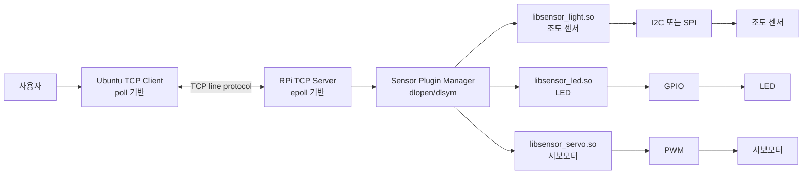
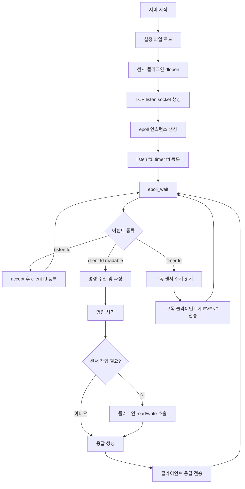
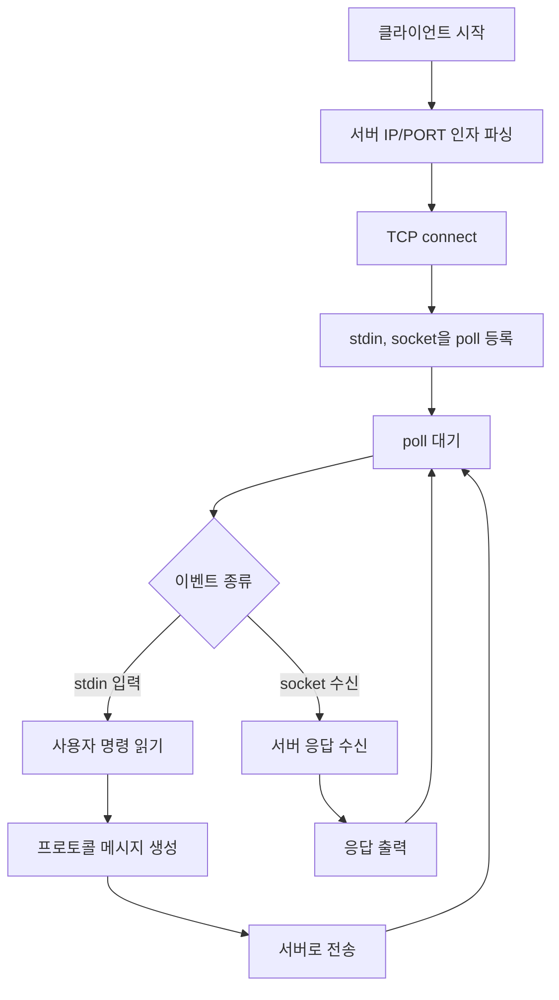
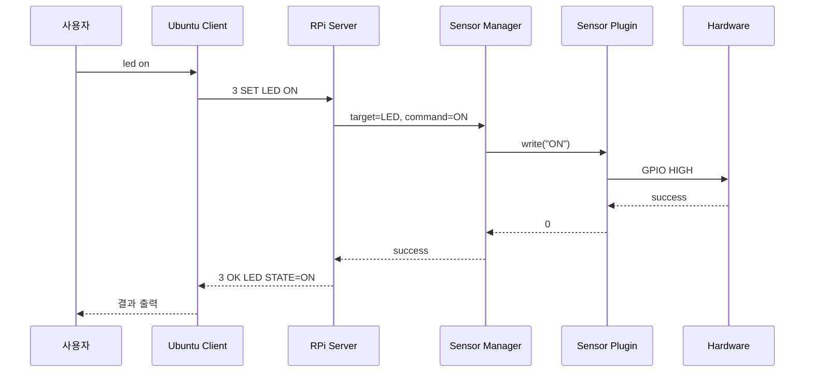
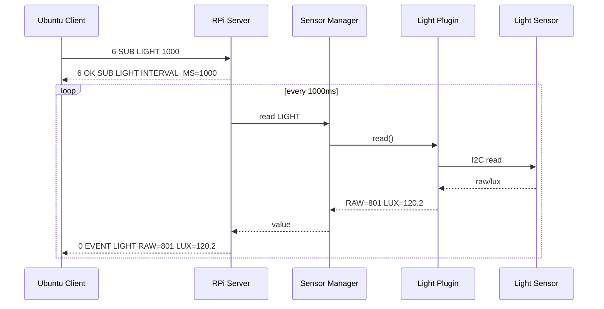

# TCP 기반 RPi 센서 제어 C 프로젝트 기획서 및 명세서

작성일: 2026-05-31  
목표 기간: 4일  
환경: WSL Ubuntu, Raspberry Pi 4 Debian, C11, TCP/IP, POSIX `poll`/`epoll`, 동적 라이브러리(`.so`)

## 1. 프로젝트 개요

WSL Ubuntu에서 TCP 클라이언트를 실행하고, Raspberry Pi 4 Debian에서 TCP 서버를 실행하여 원격으로 센서를 조회하거나 장치를 제어하는 프로젝트를 구현한다.

서버는 Raspberry Pi의 GPIO, PWM, I2C/SPI 등 하드웨어 접근을 담당한다. 각 센서 또는 장치는 독립적인 동적 라이브러리로 분리하여 서버가 실행 중 설정 파일을 기준으로 `dlopen`, `dlsym`, `dlclose` 방식으로 로드한다.

클라이언트는 Ubuntu에서 실행되며 사용자의 명령을 TCP로 서버에 전송한다. 클라이언트는 표준 입력과 서버 소켓을 동시에 처리하기 위해 `poll`을 사용한다. 서버는 여러 클라이언트 접속, 센서 이벤트, 주기적 측정을 처리하기 위해 `epoll`을 사용한다.

구현 언어는 C11로 통일한다. 서버, 클라이언트, 공통 모듈, 센서 플러그인은 모두 C로 작성하며 C++ 컴파일러나 C++ 런타임에 의존하지 않는다.

## 2. 핵심 목표

- Raspberry Pi 4에서 TCP 서버 실행
- WSL Ubuntu에서 TCP 클라이언트 실행
- 서버는 `epoll` 기반 이벤트 루프로 구현
- 클라이언트는 `poll` 기반 입력/소켓 처리로 구현
- 전체 소스는 C11 기준으로 작성
- 조도 센서, LED, 서보모터를 센서 플러그인 동적 라이브러리로 분리
- Ubuntu에서 Raspberry Pi용 서버 및 플러그인을 크로스 컴파일
- 4일 안에 시연 가능한 최소 기능 완성

## 3. 제외 범위

4일 프로젝트 범위를 지키기 위해 다음은 1차 범위에서 제외한다.

- GUI 클라이언트
- TLS 암호화 통신
- 사용자 계정/권한 시스템
- 복잡한 데이터베이스 저장
- 모바일 앱
- 실시간 고정밀 제어
- 다중 Raspberry Pi 관리

필요하면 간단한 토큰 기반 인증 정도만 옵션으로 추가한다.

## 4. 권장 하드웨어 구성

| 구분 | 권장 구성 | 비고 |
| --- | --- | --- |
| 서버 보드 | Raspberry Pi 4 | Debian 64-bit 권장 |
| 클라이언트 | WSL Ubuntu | 개발 및 크로스 컴파일 환경 |
| 조도 센서 | BH1750 I2C 조도 센서 권장 | RPi에는 아날로그 입력이 없으므로 LDR 단독 사용 불가 |
| 아날로그 조도 대안 | LDR + MCP3008 ADC | SPI 설정 필요 |
| LED | 일반 LED + 저항 | GPIO 출력 |
| 서보모터 | SG90 또는 유사 서보 | PWM 필요, 외부 전원 권장 |
| 전원 | 서보용 별도 5V 전원 | RPi GND와 공통 접지 필요 |

조도 센서를 LDR로 사용할 경우 Raspberry Pi에는 ADC가 없기 때문에 MCP3008 같은 ADC 모듈이 필요하다. 4일 완성을 목표로 하면 I2C 기반 BH1750이 구현 난이도가 낮다.

## 5. 전체 시스템 구조



## 6. 프로세스 역할

### 6.1 Raspberry Pi 서버

- TCP listen socket 생성
- 클라이언트 접속 수락
- 클라이언트 명령 파싱
- 센서 플러그인 로드 및 관리
- 센서 읽기, LED 제어, 서보 제어 수행
- 응답 및 이벤트 전송
- `epoll`로 listen socket, client socket, timer fd를 관리

### 6.2 Ubuntu 클라이언트

- 서버에 TCP 연결
- 사용자 입력을 명령 형식으로 전송
- 서버 응답 출력
- 표준 입력과 TCP 소켓을 `poll`로 동시에 감시
- 연결 종료, 재시도, 오류 메시지 처리

### 6.3 센서 동적 라이브러리

- 센서별 구현을 `.so`로 분리
- 서버 본체는 센서 내부 구현을 모름
- 공통 C ABI를 통해 초기화, 읽기, 쓰기, 종료만 호출
- 테스트용 mock 플러그인을 제공하여 WSL에서도 일부 검증 가능

## 7. 권장 디렉터리 구조

```text
sensor_tcp_project/
  CMakeLists.txt
  README.md
  configs/
    server.conf
    sensors.conf
  include/
    protocol.h
    sensor_api.h
    sensor_manager.h
  common/
    protocol.c
    logger.c
  server/
    main.c
    server_epoll.c
    client_session.c
    sensor_manager.c
  client/
    main.c
    client_poll.c
    command_cli.c
  plugins/
    light/
      light_bh1750.c
      light_mock.c
    led/
      led_gpio.c
      led_mock.c
    servo/
      servo_pwm.c
      servo_mock.c
  toolchains/
    rpi-aarch64.cmake
    rpi-armhf.cmake
  tests/
    test_protocol.c
    test_sensor_manager.c
  scripts/
    deploy_rpi.sh
```

## 8. 동적 라이브러리 설계

### 8.1 플러그인 로딩 방식

서버 시작 시 `configs/sensors.conf`를 읽고 각 센서 플러그인을 로드한다.

```text
light.name=BH1750
light.type=light
light.lib=./plugins/libsensor_light.so
light.bus=/dev/i2c-1
light.addr=0x23

led.name=STATUS_LED
led.type=led
led.lib=./plugins/libsensor_led.so
led.gpio=17

servo.name=DOOR_SERVO
servo.type=servo
servo.lib=./plugins/libsensor_servo.so
servo.pwm=0
servo.min_angle=0
servo.max_angle=180
```

### 8.2 공통 플러그인 ABI

모든 센서 플러그인은 동일한 헤더를 따른다.

```c
// include/sensor_api.h
#pragma once

#define SENSOR_API_VERSION 1

typedef enum {
    SENSOR_KIND_LIGHT = 1,
    SENSOR_KIND_LED = 2,
    SENSOR_KIND_SERVO = 3
} sensor_kind_t;

typedef struct {
    const char *key;
    const char *value;
} sensor_kv_t;

typedef struct {
    const sensor_kv_t *items;
    int count;
} sensor_config_t;

typedef struct sensor_device sensor_device_t;

typedef struct {
    int api_version;
    const char *name;
    sensor_kind_t kind;
    int (*open)(sensor_device_t **out, const sensor_config_t *config);
    int (*read)(sensor_device_t *dev, char *out, int out_len);
    int (*write)(sensor_device_t *dev, const char *command);
    void (*close)(sensor_device_t *dev);
} sensor_plugin_t;

const sensor_plugin_t *sensor_plugin_get(void);
```

### 8.3 플러그인 함수 규칙

| 함수 | 역할 |
| --- | --- |
| `sensor_plugin_get` | 플러그인 메타데이터와 함수 포인터 반환 |
| `open` | GPIO, I2C, PWM 등 초기화 |
| `read` | 조도값 등 현재 상태 읽기 |
| `write` | LED ON/OFF, 서보 각도 설정 등 제어 |
| `close` | 파일 디스크립터 및 자원 해제 |

서버는 센서 구현체의 세부 사항을 알지 않고 `sensor_plugin_t` 인터페이스만 사용한다.

## 9. TCP 프로토콜 명세

4일 내 구현을 위해 줄 단위 텍스트 프로토콜을 사용한다. 모든 메시지는 `\n`으로 끝난다.

### 9.1 요청 형식

```text
<REQ_ID> <COMMAND> [TARGET] [ARGS...]\n
```

예시:

```text
1 PING
2 GET LIGHT
3 SET LED ON
4 SET LED OFF
5 SET SERVO 90
6 SUB LIGHT 1000
7 UNSUB LIGHT
8 QUIT
```

### 9.2 응답 형식

성공:

```text
<REQ_ID> OK [KEY=VALUE...]\n
```

실패:

```text
<REQ_ID> ERR <ERROR_CODE> <MESSAGE>\n
```

서버 이벤트:

```text
0 EVENT <TARGET> [KEY=VALUE...]\n
```

### 9.3 프로토콜 예시

```text
client -> server: 1 PING
server -> client: 1 OK PONG

client -> server: 2 GET LIGHT
server -> client: 2 OK LIGHT RAW=812 LUX=123.4

client -> server: 3 SET LED ON
server -> client: 3 OK LED STATE=ON

client -> server: 4 SET SERVO 90
server -> client: 4 OK SERVO ANGLE=90

client -> server: 5 SUB LIGHT 1000
server -> client: 5 OK SUB LIGHT INTERVAL_MS=1000
server -> client: 0 EVENT LIGHT RAW=801 LUX=120.2
```

### 9.4 에러 코드

| 코드 | 의미 |
| --- | --- |
| `BAD_REQUEST` | 명령 형식 오류 |
| `UNKNOWN_COMMAND` | 지원하지 않는 명령 |
| `UNKNOWN_TARGET` | 존재하지 않는 센서/장치 |
| `BAD_ARG` | 인자 범위 오류 |
| `SENSOR_ERROR` | 센서 읽기/쓰기 실패 |
| `BUSY` | 장치 사용 중 |
| `INTERNAL` | 서버 내부 오류 |

## 10. 명령어 명세

| 명령 | 설명 | 예시 |
| --- | --- | --- |
| `PING` | 서버 상태 확인 | `1 PING` |
| `GET LIGHT` | 조도값 조회 | `2 GET LIGHT` |
| `SET LED ON` | LED 켜기 | `3 SET LED ON` |
| `SET LED OFF` | LED 끄기 | `4 SET LED OFF` |
| `SET SERVO <angle>` | 서보 각도 설정 | `5 SET SERVO 90` |
| `SUB LIGHT <ms>` | 조도 주기 이벤트 구독 | `6 SUB LIGHT 1000` |
| `UNSUB LIGHT` | 조도 이벤트 구독 해제 | `7 UNSUB LIGHT` |
| `QUIT` | 클라이언트 연결 종료 | `8 QUIT` |

### 10.1 입력 검증

- `REQ_ID`는 양의 정수
- LED 상태는 `ON` 또는 `OFF`
- 서보 각도는 기본 `0`부터 `180` 사이
- 구독 주기는 최소 `200ms` 이상 권장
- 한 줄 최대 길이는 `1024` 바이트로 제한

## 11. 서버 이벤트 루프 설계



### 11.1 서버 구현 포인트

- 모든 소켓은 non-blocking으로 설정
- `epoll`은 level-triggered로 시작하는 것을 권장
- 클라이언트별 receive buffer를 둬서 줄 단위 메시지 파싱
- partial read/write를 고려
- 클라이언트 종료 시 fd를 `epoll_ctl(DEL)` 후 close
- 센서 플러그인 호출은 짧게 끝나야 함
- 센서 작업이 오래 걸리면 2차 개선에서 worker thread 도입

## 12. 클라이언트 플로우



### 12.1 클라이언트 명령 UX

사용자는 짧은 명령으로 입력하고 클라이언트가 프로토콜 형식으로 변환한다.

```text
ping
light
led on
led off
servo 90
sub light 1000
unsub light
quit
```

## 13. 크로스 컴파일 계획

### 13.1 Raspberry Pi 아키텍처 확인

RPi에서 다음 명령으로 아키텍처를 확인한다.

```bash
uname -m
```

| 결과 | Toolchain |
| --- | --- |
| `aarch64` | `aarch64-linux-gnu-gcc` |
| `armv7l` | `arm-linux-gnueabihf-gcc` |

### 13.2 WSL Ubuntu 패키지 예시

64-bit RPi Debian 기준:

```bash
sudo apt update
sudo apt install -y build-essential cmake pkg-config gcc-aarch64-linux-gnu
```

32-bit RPi Debian 기준:

```bash
sudo apt update
sudo apt install -y build-essential cmake pkg-config gcc-arm-linux-gnueabihf
```

### 13.3 빌드 전략

- Ubuntu 클라이언트: WSL에서 native build
- RPi 서버: WSL에서 RPi target으로 cross build
- RPi 센서 플러그인: 서버와 같은 target으로 cross build
- WSL 테스트용 mock 플러그인: WSL native build

### 13.4 C 빌드 옵션

CMake 프로젝트는 C 전용으로 구성한다.

```cmake
project(sensor_tcp_project C)
set(CMAKE_C_STANDARD 11)
set(CMAKE_C_STANDARD_REQUIRED ON)
set(CMAKE_C_EXTENSIONS OFF)
add_compile_definitions(_GNU_SOURCE)

add_compile_options(
    -Wall
    -Wextra
    -Werror
    -pedantic
)
```

동적 라이브러리는 C 소스에서 바로 생성한다.

```cmake
add_executable(sensor_server server/main.c)
target_include_directories(sensor_server PRIVATE include)
target_link_libraries(sensor_server PRIVATE dl)

add_library(sensor_led SHARED plugins/led/led_gpio.c)
target_include_directories(sensor_led PRIVATE include)
target_link_libraries(sensor_led PRIVATE)
```

### 13.5 빌드 명령 예시

Ubuntu 클라이언트 빌드:

```bash
cmake -S . -B build-linux
cmake --build build-linux --target sensor_client
```

RPi 64-bit 서버 및 플러그인 빌드:

```bash
cmake -S . -B build-rpi-aarch64 -DCMAKE_TOOLCHAIN_FILE=toolchains/rpi-aarch64.cmake
cmake --build build-rpi-aarch64
```

RPi 배포:

```bash
rsync -av build-rpi-aarch64/server/sensor_server pi@<RPI_IP>:/home/pi/sensor_tcp/
rsync -av build-rpi-aarch64/plugins/*.so pi@<RPI_IP>:/home/pi/sensor_tcp/plugins/
rsync -av configs/ pi@<RPI_IP>:/home/pi/sensor_tcp/configs/
```

## 14. 네트워크 포트 및 실행 예시

기본 포트는 `5000`으로 지정한다.

RPi 서버:

```bash
./sensor_server --host 0.0.0.0 --port 5000 --config ./configs/server.conf
```

Ubuntu 클라이언트:

```bash
./sensor_client --host <RPI_IP> --port 5000
```

방화벽 또는 네트워크 문제가 있으면 RPi에서 다음을 확인한다.

```bash
ss -lntp | grep 5000
```

## 15. 데이터 흐름





## 16. 4일 개발 일정

### Day 1: 설계, 빌드 뼈대, 프로토콜

목표:

- CMake 프로젝트 생성
- 서버/클라이언트 기본 실행 파일 생성
- 공통 프로토콜 파서 구현
- mock 센서 플러그인 ABI 확정
- Ubuntu native build 확인
- RPi cross compile toolchain 확인

산출물:

- `include/sensor_api.h`
- `include/protocol.h`
- `common/protocol.c`
- `client/main.c`
- `server/main.c`
- `plugins/*_mock.c`
- CMake 빌드 성공

완료 기준:

- WSL에서 `sensor_client` 빌드 가능
- WSL에서 mock 기반 `sensor_server` 빌드 가능
- 프로토콜 파서 단위 테스트 통과

### Day 2: 센서 플러그인 구현

목표:

- LED GPIO 플러그인 구현
- 서보 PWM 플러그인 구현
- 조도 센서 플러그인 구현
- RPi에서 센서별 단독 smoke test
- mock 플러그인과 실제 플러그인 교체 가능 확인

산출물:

- `libsensor_led.so`
- `libsensor_servo.so`
- `libsensor_light.so`
- `configs/sensors.conf`
- 센서별 간단 테스트 로그

완료 기준:

- RPi에서 LED ON/OFF 동작
- RPi에서 서보 각도 변경 동작
- RPi에서 조도값 읽기 동작
- 서버 재컴파일 없이 `.so` 교체 가능

### Day 3: TCP 서버/클라이언트 통합

목표:

- 서버 `epoll` 이벤트 루프 구현
- 클라이언트 `poll` 이벤트 루프 구현
- 명령 처리 dispatch 구현
- TCP 통신으로 센서 조회/제어 성공
- 조도 구독 이벤트 구현

산출물:

- `server/server_epoll.c`
- `server/client_session.c`
- `server/sensor_manager.c`
- `client/client_poll.c`
- 통합 테스트 절차

완료 기준:

- Ubuntu 클라이언트에서 RPi 서버 접속 성공
- `ping`, `light`, `led on`, `led off`, `servo 90` 동작
- `sub light 1000` 이벤트 수신
- 클라이언트 비정상 종료 시 서버가 계속 동작

### Day 4: 안정화, 문서화, 시연 준비

목표:

- 에러 처리 보강
- 로그 출력 정리
- 배포 스크립트 작성
- README 작성
- 최종 시연 시나리오 검증

산출물:

- `README.md`
- `scripts/deploy_rpi.sh`
- 최종 실행 로그
- 발표 또는 보고서용 구조도/플로우차트

완료 기준:

- 새 터미널에서 README 절차만 따라 실행 가능
- RPi 재부팅 후 서버 재실행 가능
- 기본 명령 5개 이상 시연 가능
- 실패 상황 3개 이상에 대해 명확한 에러 응답 출력

## 17. 테스트 계획

| 단계 | 테스트 | 환경 |
| --- | --- | --- |
| 단위 테스트 | 프로토콜 파싱 | WSL Ubuntu |
| 단위 테스트 | sensor manager mock plugin | WSL Ubuntu |
| 빌드 테스트 | Ubuntu client native build | WSL Ubuntu |
| 빌드 테스트 | RPi server cross build | WSL Ubuntu |
| 하드웨어 테스트 | LED ON/OFF | RPi |
| 하드웨어 테스트 | Servo angle 0/90/180 | RPi |
| 하드웨어 테스트 | Light read | RPi |
| 통합 테스트 | TCP command/response | Ubuntu + RPi |
| 장애 테스트 | 클라이언트 강제 종료 | Ubuntu + RPi |
| 장애 테스트 | 잘못된 명령 입력 | Ubuntu + RPi |

## 18. 시연 시나리오

1. RPi에서 서버 실행
2. Ubuntu에서 클라이언트 실행
3. `ping`으로 연결 확인
4. `light`로 현재 조도값 조회
5. `led on`, `led off`로 LED 제어
6. `servo 0`, `servo 90`, `servo 180`으로 서보 제어
7. `sub light 1000`으로 1초마다 조도 이벤트 수신
8. 조도 센서에 빛을 비추거나 가려 값 변화 확인
9. `unsub light`로 이벤트 중지
10. `quit`으로 연결 종료

## 19. 주요 리스크와 대응

| 리스크 | 영향 | 대응 |
| --- | --- | --- |
| RPi 아키텍처 불일치 | cross build 실패 | `uname -m`으로 toolchain 확정 |
| 조도 센서가 아날로그 LDR만 있음 | RPi 직접 입력 불가 | MCP3008 ADC 추가 또는 BH1750 사용 |
| 서보 전류 부족 | RPi 재부팅 또는 오동작 | 서보 외부 전원 사용, GND 공통 연결 |
| GPIO/PWM 권한 문제 | 센서 제어 실패 | 실행 권한, udev, group 설정 확인 |
| 플러그인 ABI 변경 | `.so` 로드 실패 | `SENSOR_API_VERSION` 검사 |
| partial TCP read | 명령 파싱 오류 | 클라이언트별 line buffer 유지 |
| 센서 read 지연 | 서버 이벤트 루프 지연 | 1차는 짧은 read만 허용, 필요 시 worker thread |

## 20. 완료 판정 기준

아래 조건을 만족하면 4일 프로젝트 완료로 본다.

- Ubuntu 클라이언트와 RPi 서버가 TCP로 연결된다.
- 서버는 `epoll`, 클라이언트는 `poll`을 사용한다.
- 센서 기능은 서버 본체가 아니라 동적 라이브러리로 분리되어 있다.
- LED, 서보모터, 조도 센서 중 최소 3개 기능이 명령으로 동작한다.
- 조도 센서 값이 TCP 이벤트 또는 응답으로 Ubuntu에 표시된다.
- 서버 재시작 없이 설정된 플러그인 로딩 실패를 에러로 보고할 수 있다.
- README 기준으로 빌드, 배포, 실행 절차가 재현 가능하다.

## 21. 추천 구현 순서

1. 프로토콜 파서와 mock 플러그인부터 작성한다.
2. WSL에서 서버와 클라이언트를 localhost로 먼저 붙인다.
3. `poll` 클라이언트와 `epoll` 서버를 완성한다.
4. RPi cross compile을 붙인다.
5. mock 플러그인을 실제 센서 플러그인으로 교체한다.
6. 센서별 smoke test 후 TCP 통합 테스트를 진행한다.
7. 로그, 에러 처리, README를 정리한다.

이 순서로 진행하면 하드웨어 연결 문제가 생겨도 네트워크와 프로토콜 구현을 먼저 검증할 수 있어 4일 내 완성 가능성이 높다.
